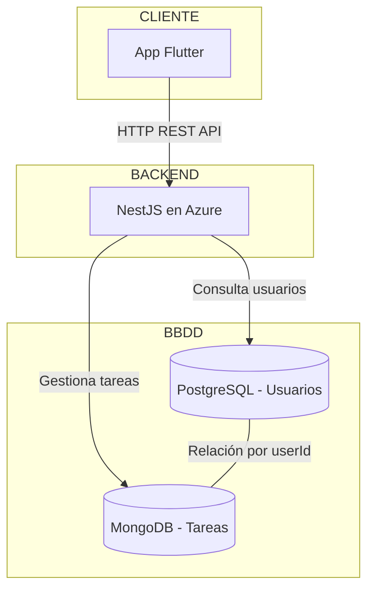

# Todoter 📋

Una aplicación moderna de gestión de tareas desarrollada con **Flutter** y **NestJS**, diseñada con una arquitectura escalable que utiliza bases de datos híbridas para optimizar el rendimiento y la flexibilidad.

[9eef4bd7-b92a-4d93-9b0a-16659e27ef06.webm](https://github.com/user-attachments/assets/47766910-4ac8-44f0-a4aa-fb8ab0c65ca7)

## 🚀 Descripción del Proyecto

Todoter es una aplicación móvil de gestión de tareas enfocada en fechas que permite a los usuarios crear, organizar y gestionar sus actividades diarias de manera eficiente. La aplicación está construida con tecnologías modernas y una arquitectura que separa las responsabilidades entre diferentes tipos de bases de datos según la naturaleza de los datos.

### Stack Tecnológico

- **Frontend:** Flutter (Dart)
- **Backend:** NestJS (Node.js/TypeScript)
- **Base de datos SQL:** PostgreSQL (usuarios y autenticación)
- **Base de datos NoSQL:** MongoDB (tareas y contenido dinámico)
- **Autenticación:** JWT (JSON Web Tokens)
- **Despliegue:** Azure (backend), Railway (bases de datos)

---

## 🏗️ Arquitectura del Sistema



### Decisiones Arquitectónicas Clave

**¿Por qué dos bases de datos diferentes?**

- **PostgreSQL para Usuarios**: Entidades con estructura bien definida, que escalan verticalmente y requieren consistencia transaccional para operaciones de autenticación y seguridad.

- **MongoDB para Tareas**: Entidades flexibles que pueden evolucionar (subtareas, repeticiones, adjuntos), permitiendo crecimiento horizontal y adaptabilidad a nuevas funcionalidades sin migraciones complejas.

---

## 📱 Funcionalidades Principales

- ✅ **Autenticación segura** con JWT
- ✅ **Creación y gestión de tareas**
- ✅ **Filtrado por fecha y estado**
- 🔄 **Próximamente**: Subtareas, patrones de repetición, recordatorios

---

## 🛠️ Instalación y Configuración Local

### Requisitos Previos

- Node.js (v16+)
- Flutter SDK
- Android Studio / Xcode
- PostgreSQL y MongoDB (local o en la nube)

### 1. Clonar el Repositorio

```bash
git clone https://github.com/jmartinezgr/prueba-tecnica-wagon
cd prueba-tecnica-wagon
```

### 2. Configurar Backend

```bash
cd server
npm install
```

Crear archivo `.env` en `/server`:
```env
POSTGRES_USER=tu_usuario
POSTGRES_PASSWORD=tu_password
POSTGRES_HOST=localhost
POSTGRES_PORT=5432
POSTGRES_DB=todoter_db
SECRET=tu_jwt_secret
MONGODB_URI=mongodb://localhost:27017/todoter
```

Ejecutar servidor:
```bash
npm run start:dev
```

### 3. Configurar Frontend

```bash
cd mobile
flutter pub get
```

Crear archivo `.env` en `/mobile`:
```env
API_BASE=http://10.0.2.2:3000/api/v1
```

Ejecutar aplicación:
```bash
flutter run
```

---

## 🔌 API Endpoints

### Autenticación `/auth`
- `POST /auth/login` - Iniciar sesión
- `POST /auth/register` - Registrar usuario
- `POST /auth/refresh` - Renovar token

### Tareas `/tasks`
- `GET /tasks` - Obtener tareas (con filtros opcionales)
- `POST /tasks` - Crear nueva tarea
- `GET /tasks/:id` - Obtener tarea específica
- `PATCH /tasks/:id` - Actualizar tarea
- `DELETE /tasks/:id` - Eliminar tarea

**Documentación completa:** Ver [`docs/endpoints_guide.md`](docs/endpoints_guide.md)

---

## 🌐 Backend Desplegado

**URL de producción:** 
```
https://todo-api-service-brg6dvfjbae7ergc.eastus2-01.azurewebsites.net/api/v1  
```

*Para usar el backend desplegado, actualiza la variable `API_BASE` en el archivo `.env` del frontend con la URL de Azure.*

---

## ❓ ¿Por qué seleccioné estos recursos?

Hubo múltiples factores que me llevaron a construir **Todoter** de la manera en que lo hice. 
Inicialmente, opté por utilizar **dos bases de datos** debido a que, en proyectos anteriores 
y en mi experiencia profesional, he visto el valor de identificar correctamente las necesidades 
de los datos y las entidades que los contienen.

Tal como detallo en [`docs/architecture.md`](docs/architecture.md), reconocí que los **usuarios**, 
por la naturaleza de la información que almacenan, requieren un **contexto relacional**, con capacidad 
de **escalar verticalmente**, garantizando la **unicidad de valores**, un control unificado de la 
autenticación y la gestión centralizada de usuarios.

Por otro lado, una entidad más **mutable** —tanto en sus campos como en las decisiones del usuario—, 
como lo son las **tareas** en mi aplicación, se beneficia del uso de una base **NoSQL**, que permite 
un **escalado horizontal** y evita dependencias entre documentos.

En resumen, esta fue una decisión estratégica, pensada para establecer bases sólidas que soporten 
el crecimiento tanto en número de usuarios como de tareas, priorizando seguridad y escalabilidad.

En cuanto a **recursos**, seleccioné **Railway** como hosting para las bases de datos por su facilidad 
de despliegue en entornos de este tipo. Para una solución como esta, considero justo y necesario utilizar 
recursos **gratuitos** y **fáciles de implementar**, ya que el valor principal está en el correcto desarrollo 
de la lógica de negocio.

Como demostración de manejo y conocimiento en servicios de hosting en la nube más utilizados actualmente, 
decidí desplegar el servicio **NestJS** en una **Web App de Azure**. Entre otras opciones, como **GCP** o **AWS**, 
elegí **Azure** por el acceso ilimitado a recursos que tengo disponibles y por mi experiencia para garantizar 
un despliegue de calidad.

En cuanto a la **arquitectura**, en el servidor prioricé el uso del **patrón repositorio** en combinación con 
la estructura nativa de **controladores y servicios de NestJS**. Esto me permite:
- Modularizar el sistema.
- Aplicar el **principio de responsabilidad única** en su máxima expresión.
- Mantener un código más legible y adaptable para futuros crecimientos.

En el proyecto **móvil**, busqué desarrollar una aplicación con **estilos actualizados**, **fluidez** y siguiendo 
uno de los patrones de arquitectura más utilizados en Flutter: el **enfoque por features**. Este patrón permite 
modularizar la app en **subaplicaciones o pantallas**, además de aprovechar **recursos compartidos (shared)** 
para maximizar la reutilización de widgets, lógica de negocio y peticiones HTTP.

Finalmente, el código está acompañado de **documentación in-code** siguiendo los estándares, así como de 
documentación complementaria en la carpeta [`docs`](docs).

---
## ❓ ¿Que aprendi y que me gustaria implementar en la app?

La app fue diseñada como un MVP, pense en multiples funcionalidades interesantes como notificaciones, subtareas, repetición horaria, etc. 
El tiempo fue apremiante y produje un producto que cumple con las especificaciones, donde tuve la oportunidad de aprender Flutter y toda la 
logica detras de un framework de desarrollo multiplataforma con mucha proyección y que me genero mucho interes. En una app sencilla, pude aprender
diseñar, desarrollar y mejorar mis habilidades. 


--- 

## 📸 Capturas de Pantalla

<!-- TODO: Agregar capturas de pantalla de la aplicación -->

### Pantalla de Login

<p align="center">
  
  
  
  
</p>

### Lista de Tareas

#### Tareas Programadas y No Programadas

<p align="center">
  

  
</p>

#### Días Sin Tarea Programada

<p align="center">
  
</p>

### Crear Nueva Tarea

<p align="center">
  
  
</p>

### Editar Tarea

<p align="center">
  
</p>

---

## 🏭 Módulos del Sistema

### 🔐 Auth Module
Gestiona toda la lógica de autenticación y autorización:
- Registro e inicio de sesión de usuarios
- Generación y validación de JWT tokens
- Middleware de protección para rutas sensibles
- Integración con PostgreSQL para datos de usuario

### 👥 Users Module
Maneja las operaciones CRUD de usuarios:
- Creación y gestión de perfiles de usuario
- Validación de datos y unicidad de emails
- Interacción directa con PostgreSQL

### ✅ Tasks Module
Núcleo funcional de la aplicación:
- CRUD completo de tareas
- Filtrado por fecha, estado y programación
- Arquitectura preparada para subtareas y repeticiones
- Integración con MongoDB para flexibilidad de datos

---
## 📞 Contacto

**Desarrollador:** Juan José Martínez  
**GitHub:** [@jmartinezgr](https://github.com/jmartinezgr)

---

*Todoter - Organizando tu día, una tarea a la vez* ✨
