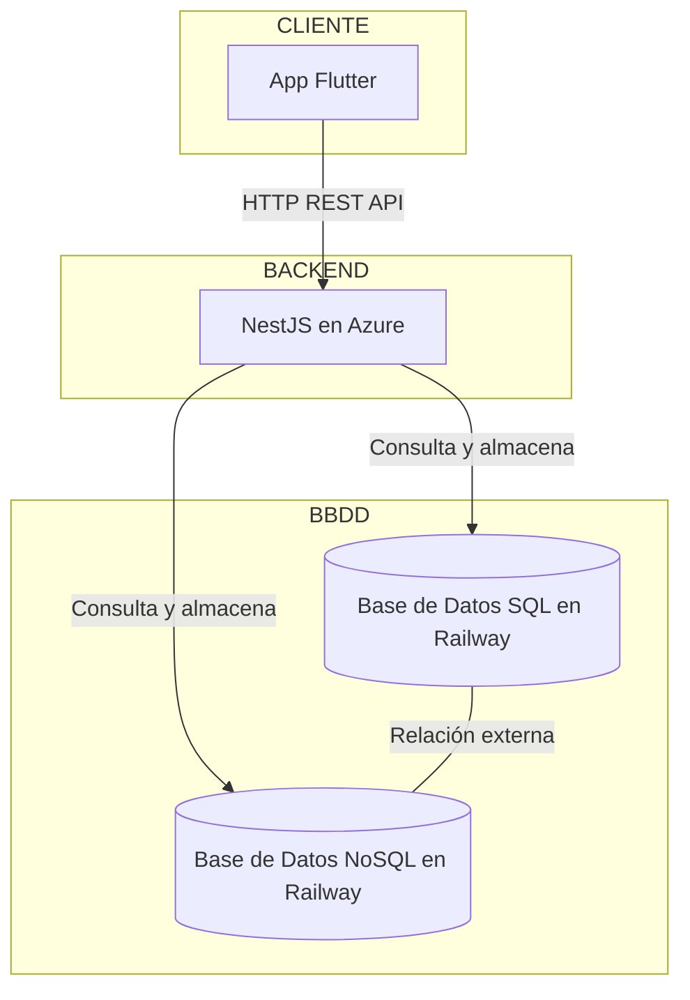

# Arquitectura del Proyecto

Se diseñó un flujo acorde al enunciado planteado, usando **NestJS** como framework para el backend y **Flutter** como framework móvil para el cliente. Se optó por un sistema que utiliza dos tipos de bases de datos, cada una encargada de un diferente tipo de entidad en nuestra aplicación.

## ¿Por qué dos bases de datos diferentes?

Las características de nuestras entidades eran bastante distintas:

- **Usuarios:**  
  Son entidades con características bien definidas desde el inicio de la aplicación, que escalan verticalmente. Los cambios o migraciones futuras son menores, y las columnas tienen sentido en todos los registros de la tabla. Por eso, una base de datos relacional (SQL) es adecuada para almacenar esta información.

- **Tareas (TODO / Task):**  
  Son entidades que cambian con facilidad y pueden crecer en complejidad. Se consideraron funcionalidades futuras como subtareas, listas de repetición por días, imágenes y otros elementos que complicarían un diseño relacional.  

  Por tanto, un documento en una base de datos NoSQL (MongoDB) se considera más apto para una entidad cambiante, adaptable y con crecimiento horizontal, compatible con el diseño del flujo principal de la aplicación.

Asignando un contexto de bases de datos adecuado a cada entidad, se diseña un sistema con proyección a la escalabilidad, manejo eficiente de servicios y modularización gracias a la naturaleza de NestJS. Esto resulta en una aplicación moderna y pensada para el futuro.

---

## Módulos principales de la lógica de negocio

### auth

El módulo de autenticación se encarga de toda la lógica necesaria para individualizar y proteger el manejo de la información dentro de la aplicación. Maneja los JWT, que son la herramienta elegida para proteger los endpoints más sensibles. 

Incluye funcionalidades de inicio de sesión, registro de nuevos usuarios, refresco de credenciales y manejo seguro de la información de usuarios autenticados. Provee además un middleware (Guard) que valida automáticamente que las credenciales sean válidas, y verifica en las bases de datos que cada usuario solo pueda interactuar con sus propios datos.

### users

Este módulo maneja toda la lógica relacionada con los usuarios, interactuando directamente con la base de datos SQL donde se almacenan. Se encarga de buscar, crear y eliminar usuarios, servicios que son consumidos por el módulo de autenticación para mantener la seguridad y consistencia.

### tasks

Este es el módulo principal (core) de la aplicación. Utiliza los middleware de protección provistos por el módulo `auth` para servir al cliente Flutter todo lo necesario para crear, editar, actualizar y eliminar tareas.  

Interactúa de forma aislada con la base de datos NoSQL (MongoDB), pero siempre relacionado al usuario que respalda el contexto SQL, asegurando coherencia entre ambas bases de datos.

---