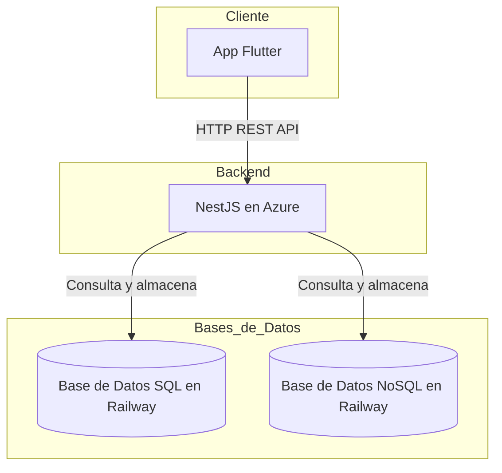

```mermaid
graph TD
  subgraph Cliente
    A[App Flutter]
  end

  subgraph Backend
    B[NestJS en Azure]
  end

  subgraph Bases_de_Datos
    C[(Base de Datos SQL en Railway)]
    D[(Base de Datos NoSQL en Railway)]
  end

  A -->|HTTP REST API| B
  B -->|Consulta y almacena| C
  B -->|Consulta y almacena| D
```